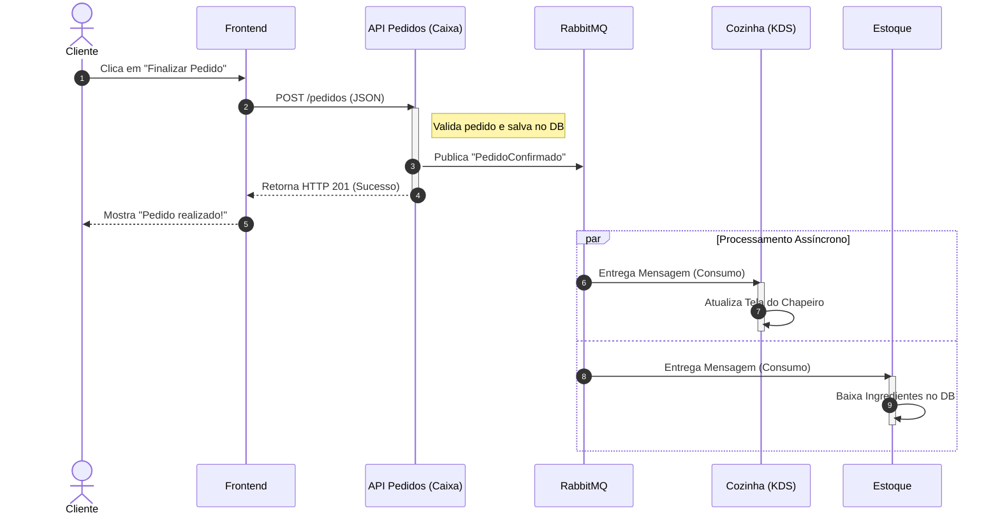

# 🍔 Sistema Distribuído Ceará Lanches

> Projeto para a disciplina de Sistemas Distribuídos | UFRPE

Este projeto implementa um sistema de gerenciamento de pedidos para uma hamburgueria baseado em uma **Arquitetura Orientada a Eventos (Event-Driven Architecture)**. 

O objetivo é demonstrar conceitos fundamentais de sistemas distribuídos, como desacoplamento de serviços, comunicação assíncrona via filas de mensagens e tolerância a falhas.

---

## 🏛️ Arquitetura do Sistema

O sistema foi dividido em **4 módulos independentes** que simulam os setores reais de uma hamburgueria. A comunicação crítica entre o backend acontece de forma assíncrona utilizando **RabbitMQ**.


### Os 4 Módulos:

#### 1. 📱 Módulo Cliente (Frontend / Vitrine)
* **Responsabilidade:** Interface para o cliente realizar o pedido.
* **Tecnologia:** HTML5, CSS3, JavaScript (Fetch API).
* **Comunicação:** Envia requisições HTTP (REST) síncronas para o Módulo de Pedidos.

#### 2. 💰 Módulo de Pedidos (Caixa / Gateway)
* **Responsabilidade:** Receber o pedido do cliente, validar e confirmar o pagamento.
* **Ação Distribuída:** Ao confirmar um pedido, este módulo atua como **Producer**, publicando uma mensagem `PedidoConfirmado` na fila do RabbitMQ. Ele não sabe quem vai preparar ou estocar o item.
* **Tecnologia:** Python + Flask.

#### 3. 👨‍🍳 Módulo da Cozinha (KDS - Kitchen Display System)
* **Responsabilidade:** Gerenciar a fila de preparação.
* **Ação Distribuída:** Atua como **Consumer**. Escuta a fila do RabbitMQ. Quando um pedido chega, ele atualiza a interface do cozinheiro em tempo real (ou via polling).
* **Interface:** Possui uma UI própria para o chapeiro visualizar os pedidos pendentes.
* **Tecnologia:** Python + Flask (Backend) + HTML/JS (Frontend do Cozinheiro).

#### 4. 📦 Módulo de Estoque (Inventário)
* **Responsabilidade:** Controle de insumos.
* **Ação Distribuída:** Atua também como **Consumer** da *mesma mensagem* `PedidoConfirmado`.
* **Processo:** Para cada lanche vendido, ele dá baixa automática nos ingredientes (ex: -1 Pão, -1 Carne) no banco de dados.
* **Tecnologia:** Python + Flask.

---

## 🛠️ Tecnologias Utilizadas

* **Linguagem:** Python 3.9+
* **Framework Web:** Flask
* **Banco de Dados:** SQLite3 (persistência de dados)
* **Message Broker:** RabbitMQ (Imagem Oficial Management)
* **Cliente AMQP:** Pika (Biblioteca Python para RabbitMQ)
* **Documentação API:** Flasgger (Swagger)
* **Orquestração:** Docker & Docker Compose

---

## 📂 Estrutura do Projeto

O projeto utiliza Docker Compose para subir todo o ambiente com um único comando.

```text
/
├── docker-compose.yml      # Orquestração de todos os contêineres
├── requirements.txt        # Dependências Python
├── test_sistema.py         # Script de teste automatizado
├── caixa/                  # Serviço de Pedidos (Gateway)
│   ├── app.py              # API REST para pedidos
│   ├── database.py         # Camada de banco de dados
│   ├── caixa.db            # SQLite (gerado em runtime)
│   └── Dockerfile
├── cozinha/                # Serviço da Cozinha
│   ├── app.py              # Consumer RabbitMQ (processamento)
│   ├── api.py              # API REST para consultas
│   ├── database.py         # Camada de banco de dados
│   ├── cozinha.db          # SQLite (gerado em runtime)
│   └── Dockerfile
└── estoque/                # Serviço de Estoque
    ├── app.py              # Consumer RabbitMQ (baixa de ingredientes)
    ├── api.py              # API REST para consultas
    ├── database.py         # Camada de banco de dados
    ├── estoque.db          # SQLite (gerado em runtime)
    └── Dockerfile
```
---

## Modelagem Arquitetura

```mermaid
graph TD
    %% Estilos (Cores)
    classDef frontend fill:#e1f5fe,stroke:#01579b,stroke-width:2px,color:#000;
    classDef backend fill:#fff3e0,stroke:#e65100,stroke-width:2px,color:#000;
    classDef broker fill:#f3e5f5,stroke:#4a148c,stroke-width:2px,stroke-dasharray: 5 5,color:#000;
    classDef database fill:#e8f5e9,stroke:#1b5e20,stroke-width:1px,color:#000;

    %% Atores
    Client(👤 Cliente / Navegador)

    %% Módulo 1: Frontend
    subgraph Mod1 [Módulo 1: Frontend]
        UI["🖥️ Interface Web"]
    end

    %% Módulo 2: Backend Pedidos
    subgraph Mod2 [Módulo 2: Caixa]
        API_Pedidos["⚙️ API de Pedidos<br/>(Flask)"]
        DB_Pedidos[("🛢️ DB Pedidos")]
    end

    %% Broker
    Rabbit{"🐰 RabbitMQ<br/>Fila: Pedidos"}

    %% Módulo 3: Cozinha
    subgraph Mod3 [Módulo 3: Cozinha]
        Worker_Cozinha["⚙️ Worker Cozinha"]
        Display_Cozinha["🖥️ Tela do Chapeiro"]
    end

    %% Módulo 4: Estoque
    subgraph Mod4 [Módulo 4: Estoque]
        Worker_Estoque["⚙️ Worker Estoque"]
        DB_Estoque[("🛢️ DB Estoque")]
    end

    %% Relacionamentos
    Client -->|1. Acessa| UI
    UI -->|2. POST /pedidos| API_Pedidos
    API_Pedidos -->|3. Salva| DB_Pedidos
    API_Pedidos -.->|4. Publica Evento| Rabbit

    Rabbit -.->|5. Consome msg| Worker_Cozinha
    Rabbit -.->|5. Consome msg| Worker_Estoque

    Worker_Cozinha -->|Atualiza| Display_Cozinha
    Worker_Estoque -->|Baixa Insumo| DB_Estoque

    %% Aplicando Estilos
    class UI frontend;
    class API_Pedidos,Worker_Cozinha,Worker_Estoque,Display_Cozinha backend;
    class Rabbit broker;
    class DB_Pedidos,DB_Estoque database;
```



---

## Diagrama de Sequência



## 🚀 Como Rodar o Projeto

Siga as instruções abaixo para executar o protótipo em sua máquina local. O projeto é totalmente containerizado, exigindo apenas o Docker instalado.

### 📋 Pré-requisitos

* **Docker** e **Docker Compose** instalados.
* **Git** instalado.

### 🔧 Passo a Passo

1.  **Clone o repositório:**
    ```bash
    git clone [https://github.com/brunosouzx/Sistemas_Distribuidos_UFRPE.git](https://github.com/brunosouzx/Sistemas_Distribuidos_UFRPE.git)
    cd Sistemas_Distribuidos_UFRPE
    ```

2.  **Suba o ambiente (Build & Run):**
    Execute o comando abaixo na raiz do projeto para construir as imagens e iniciar os containers:
    ```bash
    docker-compose up --build
    ```
    > **Dica:** Mantenha este terminal aberto para visualizar os logs de comunicação entre os sistemas (Caixa, Cozinha e Estoque).

3.  **Acesse as Interfaces:**

    | Módulo | URL | Descrição |
    | :--- | :--- | :--- |
    | **Swagger Caixa** | [http://localhost:5000/apidocs](http://localhost:5000/apidocs) | Interface para realizar pedidos via HTTP. |
    | **Swagger Cozinha API** | [http://localhost:5001/apidocs](http://localhost:5001/apidocs) | Interface para consultar fila e estatísticas da cozinha. |
    | **Swagger Estoque API** | [http://localhost:5002/apidocs](http://localhost:5002/apidocs) | Interface para consultar e gerenciar estoque. |
    | **RabbitMQ Manager** | [http://localhost:15672](http://localhost:15672) | **User:** `guest` / **Pass:** `guest`. Para monitorar filas. |

4.  **Teste o sistema:**
    Execute o script de teste automatizado para validar todas as funcionalidades:
    ```bash
    python test_sistema.py
    ```

---

## 📊 Funcionalidades Implementadas

### ✅ Persistência com SQLite

Substituição completa do JSON por bancos de dados SQLite com schema estruturado:

#### **Caixa (caixa.db)**
- Tabela `pedidos`: Registra todos os pedidos com status, valor e timestamps
- Tabela `cardapio`: Catalogo de produtos disponíveis com preços
- Validações de integridade e consultas otimizadas

#### **Cozinha (cozinha.db)**
- Tabela `pedidos_cozinha`: Rastreamento de pedidos em preparação
- Controle de tempo de preparo e status (RECEBIDO → PREPARANDO → PRONTO)
- Estatísticas de performance da cozinha

#### **Estoque (estoque.db)**
- Tabela `ingredientes`: Controle de quantidade com alertas de estoque baixo
- Tabela `receitas`: Relacionamento ingredientes × produtos
- Tabela `movimentacoes`: Histórico completo de entradas/saídas
- Validação de disponibilidade antes de aceitar pedidos

### 🔍 APIs REST para Consulta

Cada serviço possui endpoints para consulta e monitoramento:

**Caixa (porta 5000):**
- `GET /pedidos` - Lista pedidos (com filtro por status)
- `GET /pedidos/{id}` - Busca pedido específico
- `GET /cardapio` - Lista itens disponíveis
- `POST /pedidos` - Cria novo pedido

**Cozinha API (porta 5001):**
- `GET /fila` - Visualiza fila de preparação
- `GET /pedidos/{status}` - Filtra por status (RECEBIDO, PREPARANDO, PRONTO)
- `GET /estatisticas` - Estatísticas de performance

**Estoque API (porta 5002):**
- `GET /estoque` - Lista todos os ingredientes com status
- `GET /estoque/{ingrediente}` - Consulta ingrediente específico
- `POST /estoque/{ingrediente}/adicionar` - Repõe estoque
- `GET /estoque/historico` - Histórico de movimentações
- `GET /estoque/verificar/{produto}` - Verifica disponibilidade

### 🎯 Melhorias de Arquitetura

- **Separação de responsabilidades**: Database layer isolada em módulos dedicados
- **Context managers**: Gestão automática de conexões com SQLite
- **Transações atômicas**: Rollback automático em caso de erro
- **Índices de performance**: Consultas otimizadas por status
- **Documentação Swagger**: Todas as APIs documentadas interativamente

---


## 🛑 Como Parar

Para parar a execução e remover os containers, pressione `Ctrl+C` no terminal ou rode:

```bash
docker-compose down