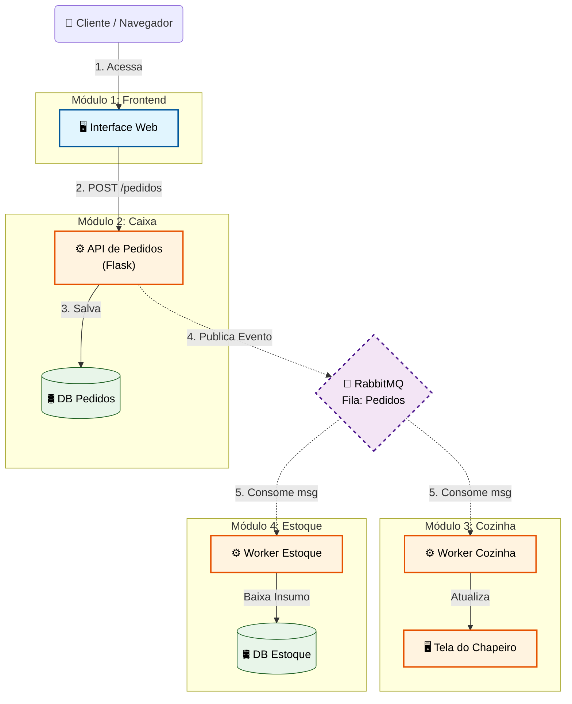
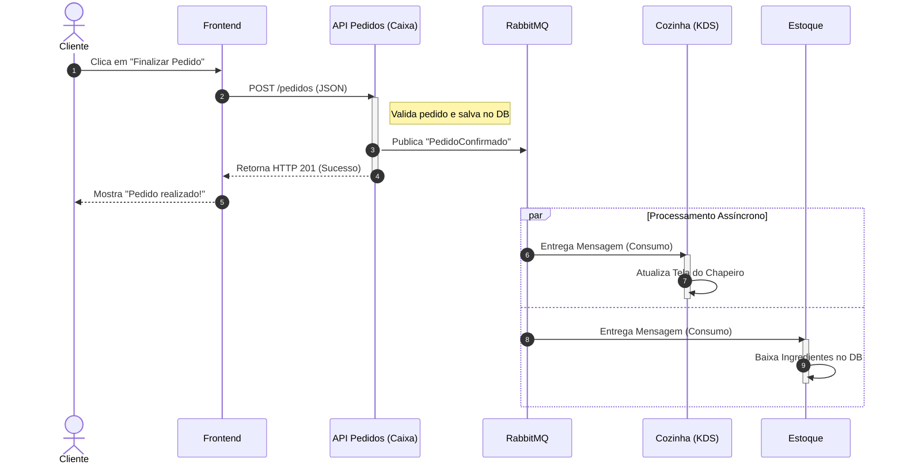

# 🍔 Sistema Distribuído Ceará Lanches

> Projeto para a disciplina de Sistemas Distribuídos | UFRPE

Este projeto implementa um sistema de gerenciamento de pedidos para uma hamburgueria baseado em uma **Arquitetura Orientada a Eventos (Event-Driven Architecture)**. 

O objetivo é demonstrar conceitos fundamentais de sistemas distribuídos, como desacoplamento de serviços, comunicação assíncrona via filas de mensagens e tolerância a falhas.

---

## 🏛️ Arquitetura do Sistema

O sistema foi dividido em **4 módulos independentes** que simulam os setores reais de uma hamburgueria. A comunicação crítica entre o backend acontece de forma assíncrona utilizando **RabbitMQ**.


### Os 4 Módulos:

#### 1. 📱 Módulo Cliente (Frontend / Vitrine)
* **Responsabilidade:** Interface para o cliente realizar o pedido.
* **Tecnologia:** HTML5, CSS3, JavaScript (Fetch API).
* **Comunicação:** Envia requisições HTTP (REST) síncronas para o Módulo de Pedidos.

#### 2. 💰 Módulo de Pedidos (Caixa / Gateway)
* **Responsabilidade:** Receber o pedido do cliente, validar e confirmar o pagamento.
* **Ação Distribuída:** Ao confirmar um pedido, este módulo atua como **Producer**, publicando uma mensagem `PedidoConfirmado` na fila do RabbitMQ. Ele não sabe quem vai preparar ou estocar o item.
* **Tecnologia:** Python + Flask.

#### 3. 👨‍🍳 Módulo da Cozinha (KDS - Kitchen Display System)
* **Responsabilidade:** Gerenciar a fila de preparação.
* **Ação Distribuída:** Atua como **Consumer**. Escuta a fila do RabbitMQ. Quando um pedido chega, ele atualiza a interface do cozinheiro em tempo real (ou via polling).
* **Interface:** Possui uma UI própria para o chapeiro visualizar os pedidos pendentes.
* **Tecnologia:** Python + Flask (Backend) + HTML/JS (Frontend do Cozinheiro).

#### 4. 📦 Módulo de Estoque (Inventário)
* **Responsabilidade:** Controle de insumos.
* **Ação Distribuída:** Atua também como **Consumer** da *mesma mensagem* `PedidoConfirmado`.
* **Processo:** Para cada lanche vendido, ele dá baixa automática nos ingredientes (ex: -1 Pão, -1 Carne) no banco de dados.
* **Tecnologia:** Python + Flask.

---

## 🛠️ Tecnologias Utilizadas

* **Linguagem:** Python 3.9+
* **Framework Web:** Flask
* **Message Broker:** RabbitMQ (Imagem Oficial Management)
* **Cliente AMQP:** Pika (Biblioteca Python para RabbitMQ)
* **Orquestração:** Docker & Docker Compose

---

## 📂 Estrutura do Projeto

O projeto utiliza Docker Compose para subir todo o ambiente com um único comando.

```text
/
├── docker-compose.yml      # Orquestração de todos os contêineres
├── modulo_1_cliente/       # Frontend do Cliente
│   ├── index.html
│   └── script.js
├── modulo_2_pedidos/       # API de Pedidos (Producer)
│   ├── app.py              # Aplicação Flask
│   └── Dockerfile
├── modulo_3_cozinha/       # Serviço da Cozinha (Consumer + UI)
│   ├── app.py              # Aplicação Flask + Thread Consumer
│   ├── templates/          # Interface do Cozinheiro
│   └── Dockerfile
└── modulo_4_estoque/       # Serviço de Estoque (Consumer)
    ├── app.py              # Aplicação Flask + Thread Consumer
    └── Dockerfile
```
---

## Modelagem Arquitetura



---

## Diagrama de Sequência


